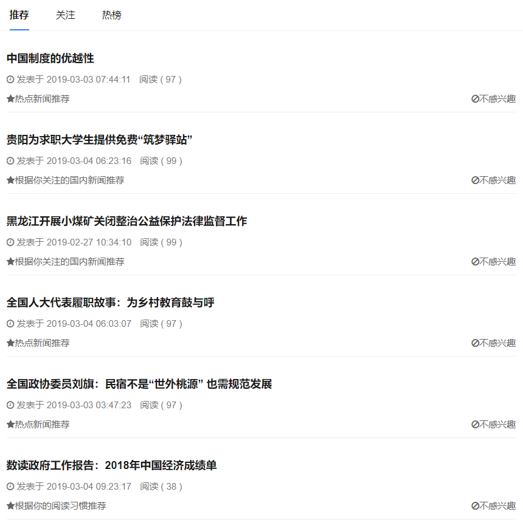

# personalizedNewsRecommendationSystem
使用图数据库开发的新闻推荐系统

## 本系统使用Neo4j作为图数据进行开发

### 主要使用的算法有：

- 协同过滤
- 基于新闻相似的推荐算法
- TextRank文本关键字提取

### 实现的功能有：
- 各种推荐功能
- 用户互相关注
- 新闻评论
- 新闻收藏
- 兴趣迁移机制

-----

#### 效果图


-----

### 项目启动
```
  #运行项目需要docker环境 把neo4j的数据下载到对应的磁盘   这里我是把数据放到d盘
  docker run -p 7474:7474 -p 7473:7473 -p 7687:7687 -v d:/neo4j/conf:/conf -v d:/neo4j/data:/data --name=neo4j -d
  
  #neo4j启动之后运行java项目
```

### 项目地址：127.0.0.1:8080
